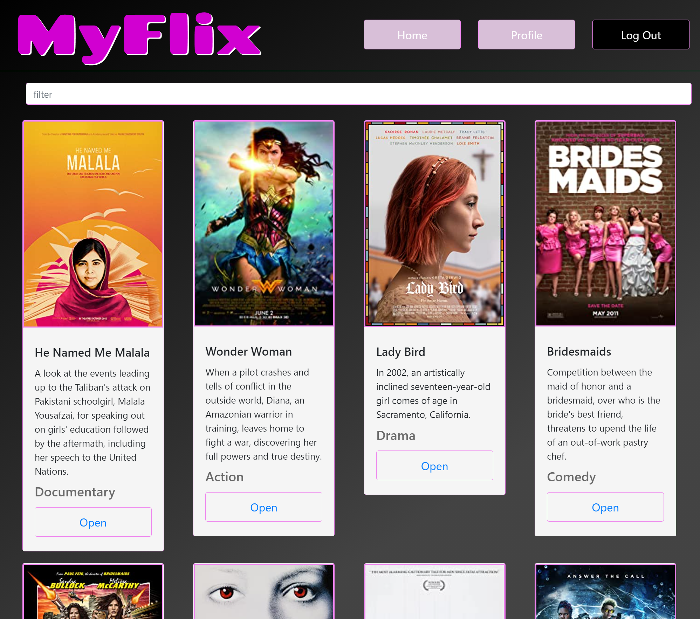

# MyFlix-client
A movie app that allows users to sign up, log in, and view or filter through a list of movies. Users can add movies to their own 'Favorites' and 'To Watch' lists. Along with that, users can view and edit their profile information.

**[Click here to View App](https://myflix-jenpyle.netlify.app/)**

<p align="center">

</p>

## Technical Details
This repo contains the frontend of a single page application built with React. The complete stack of this full-stack application consists of **MongoDB**, **Express**, **React**, **Redux**, and **Node.js**. The [server-side](https://github.com/jenpyle/myFlix-server) is hosted on Heroku and processes API requests sent to the database. Documentation for the API is available [here](https://jennysflix.herokuapp.com/documentation.html). The app is hosted on Netlify at [https://myflix-jenpyle.netlify.app/](https://myflix-jenpyle.netlify.app/)

Redux is used to manage the application's state, and navigation between different views is implimented via client-side state routing. Client-side authentication and authorization is integrated with the backend logic using Axios, along with JWT-based authentication and basic HTTP authentication. The application also uses Bootstrap as a UI library for styling and responsiveness.

## How to get the project running
This project uses Parcel for building, and Babel for transpilation.


### Install Dependencies

```
npm install
```

### Run

To build the project in the terminal run:
```
parcel src/index.html
```
or:
```
npm start
```


## Project dependencies (e.g., JavaScript version, ESLint rules)
JavaScript version: ECMAScript 2015 (ES6)
```
  	"dependencies": {
		"axios": "^0.21.1",
		"bootstrap": "^4.6.0",
		"jquery": "^3.6.0",
		"prop-types": "^15.7.2",
		"react": "^17.0.2",
		"react-bootstrap": "^1.5.2",
		"react-dom": "^17.0.2",
		"react-redux": "^7.2.4",
		"react-router-dom": "^5.2.0",
		"redux": "^4.1.0",
		"redux-devtools-extension": "^2.13.9",
		"redux-thunk": "^2.3.0"
	},
	"devDependencies": {
		"parcel-bundler": "^1.12.5",
		"sass": "^1.41.1"
	}
```
